# CC5205 - Proyecto-Mineria de datos

## Motivación:

>La industria musical ha estado en ascenso por décadas, últimamente la forma más popular para consumir música es a través de plataformas tales como Spotify, Apple Music, Soundcloud, etc. Siendo el más popular de estas Spotify, es interesante ver cómo el éxito de ciertos géneros/artistas ha cambiado gracias a esta forma de consumo, siendo importantes los algoritmos de recomendación a usuarios, las playlists hechas por la plataforma para destacar artistas de cierto género y el compartir tu música con los demás.
  
Es impresionante ver cómo las playlists mencionadas anteriormente creadas por Spotify tales como "Viva Latino" "Rock Classics" "K-Pop ON!", etc. Cuentan cada una con más de cinco millones de likes otorgados por usuarios que disfrutan de dichos específicos géneros, esta forma de categorización de la música es incluso tan importante para la plataforma que en el menú de exploración principal es el filtro recomendado para buscar tu música preferida, sugiriéndolo por sobre una búsqueda por artista o década.
  
Creemos que, dado esto y la gran cantidad de datos disponibles de la plataforma, es posible estudiar una conexión entre características cuantificables de las canciones y el género al que estas pertenecerán.

# Hito 1: Fase Exploratoria

## Resumen de resultados

### Gráfico de Frecuencia de Keys por género

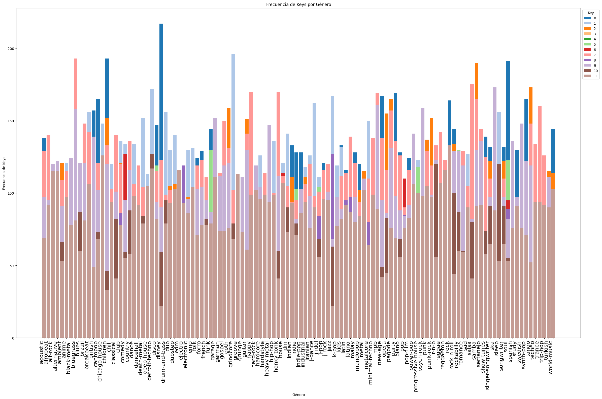

### Gráfico de Matrices de Correlación por género
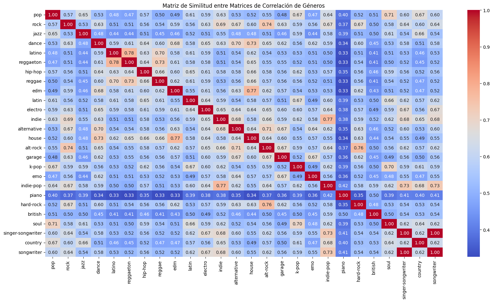

### Gráfico de Time Signatures por género
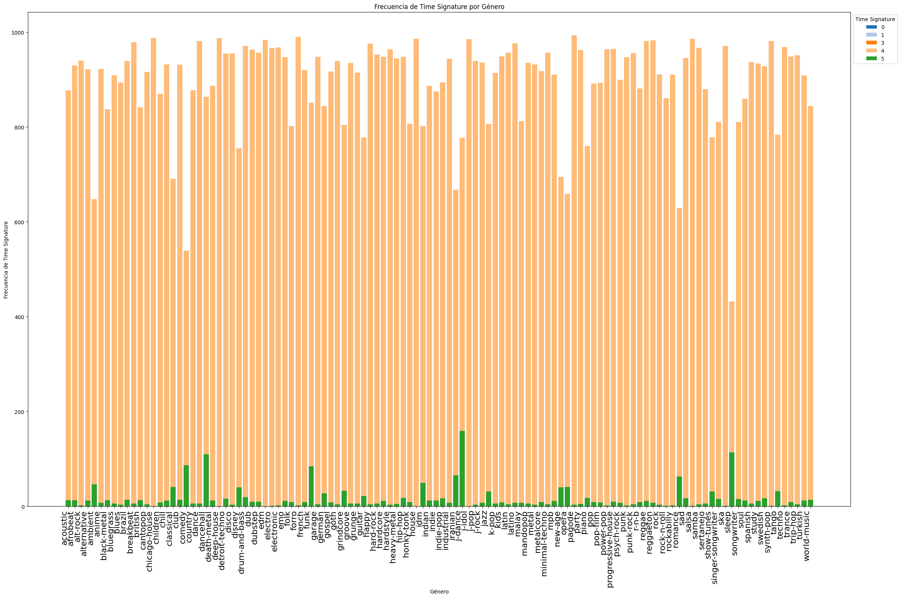

## Conclusión Hito 1:

>En base a los gráficos de Mode y Time_signature podemos concluir que no son atributos que permitan clasificar a que género se pertenece.
  
Mode: La mayoría de los géneros tienen Mode tipo 1, lo que significa que no será un atributo musical que permita distinguir claramente a los géneros, a excepción de "sad" o "turkish"
  
Time_signature: Al igual que para Mode, la mayoría de los géneros tienen principalmente Time_signature 4, lo que significa que no será un atributo musical que permita distinguir al momento de clasificar por géneros.
  
Por otro lado, duration_ms es un atributo musical que permitirá distinguir con claridad algunos géneros, es por ello que para el Hito 2 se debe evaluar si dentro de los géneros con los que se trabajará se encuentran aquellos distinguibles por este atributo.
  
Para 'explicit' ocurre similar, hay géneros en que la mayoría de canciones son no explicitas, otros en los que hay igual cantidad de explicitas y no explicitas, y aquellos que tienen más explicitas que no explicitas. Por ello, será importante evaluar que tanto se sigue cumpliendo una vez que se reduzca la cantidad de géneros.
  
Los atributos utilizados en las matrices de correlación (danceability, energy, loudness, speechiness, acousticness, instrumentalness, liveness, valence y tempo) mostrarón diferentes valores dependiendo de cada género. Por ello, se tendrán en cuenta al momento de clasificar géneros, y en caso de que el modelo no sea óptimo se evaluará eliminar los atributos menos relevantes para distinguir entre géneros, como es el caso de 'keys' en donde todos los géneros tienen gran cantidad de canciones con key igual a 11.

# Hito 2: Metodología 1

>Se busca responder la siguiente preguntas mediante la aplicación de modelos de clasificación: 

## (1) ¿Es posible predecir el género al que pertenece una canción de acuerdo a las variables musicales tales como el tempo, la valencia musical, cantidad de beats, entre otros?

## Modelos

### Support Vector Machine (SVM)

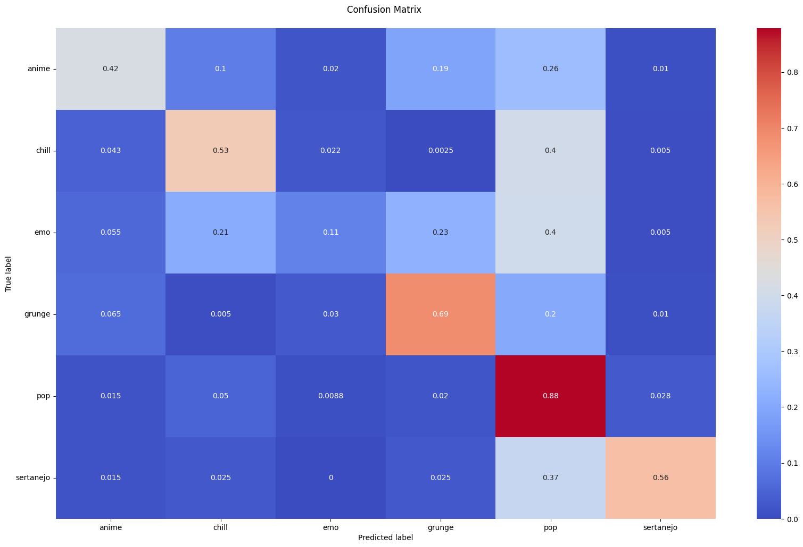
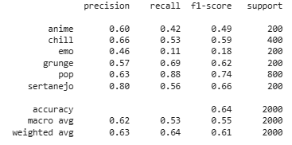

### Gradient Boost Machine

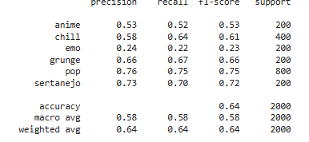

### Naive Bayes

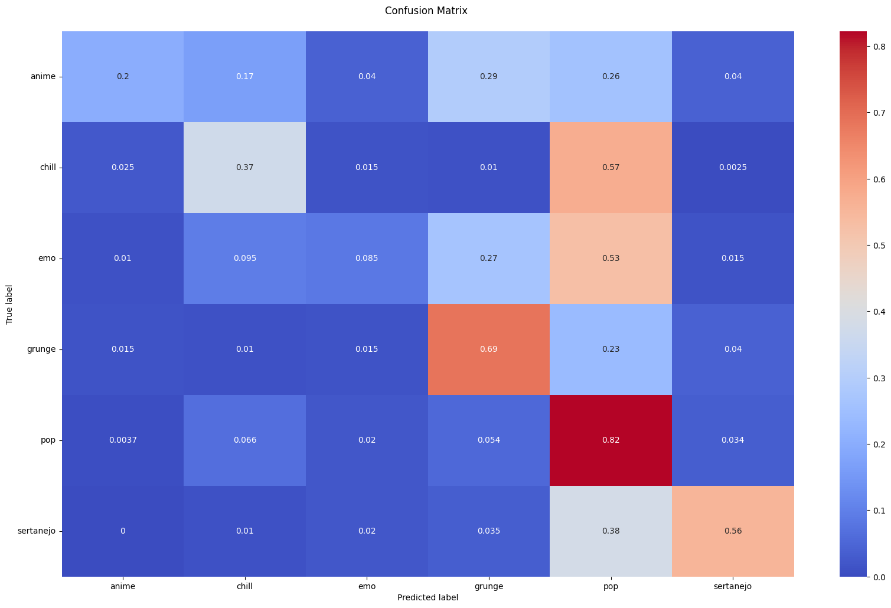
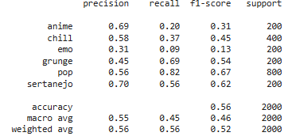

## Conclusión Hito 2:

>Inicialmente se consideró trabajar con las 50 clases más populares, pero debido a la complejidad y mal desempeño del modelo, se redujo al top 10. Manteniendo el merge de clases similares y técnicas de sampling. Una vez realizado esto, se trabajó con las 6 clases restantes, notando una inmediata mejoría en el rendimiento del modelo, concluyendo que el reducir la cantidad de clases, ayuda significativamente el desempeño y complejidad de un modelo.

>Dentro del pre-procesamiento se construyeron tres dataframes, uno con los datos originales procesados, otro agregando estandarización y otro agregando normalización. A partir de los resultados se concluyó que la estandarización fue la técnica que más ayudó al desempeño de los modelos, permitiendoles mejorar cerca de 0.20 puntos en accuracy y hasta 0.43 puntos en la precision macro avg.

>Luego, una vez entrenados y testeados los modelos, se analizaron los resultados de las métricas obtenidas, en donde se obtuvo que:
   
> **SVM Model**:  
> El modelo base tuvo un desempeño de 0.52 en precision (macro avg) y 0.58 en accuracy. Mientras que al utilizar GridSearch se obtuvo 0.62 en precision (macro avg) y 0.64 en accuracy, mejorando en comparación al modelo base con los hiperparámetros C = 10, gamma = 0.1 y kernel = rbf y una Cross Validation=5.
   
>**Gradient Boost Model**:  
> El modelo base tuvo un desempeño de 0.52 en precision (macro avg) y 0.58 en accuracy. Mientras que al utilizar GridSearch se obtuvo 0.59 en precision (macro avg) y 0.64 en accuracy, mejorando en comparación al modelo base con los hiperparámetros max_depth=8 y n_estimators=100, utilizando una Cross Validation=3.
 
>Posteriormente se entreno con una Cross Validation de 5 y learning rate de 0.3, obteniendo 0.59 en precision (macro avg) y 0.63 en accuracy, no mejorando así al incrementar la Cross Validation y el learning rate.
   
**Bayes Model**:  
> El modelo base tuvo un desempeño de 0.41 en precision (macro avg) y 0.35 en accuracy. Mientras que al utilizar GridSearch se obtuvo 0.55 en precision (macro avg) y 0.56 en accuracy. Mejorando en comparación al modelo base con los parámetros de var_smoothing=0.284 y Cross Validation = 5.

> Como acotación, en las matrices de confusión obtenidas a partir de los resultados de cada modelo, se observa que la etiqueta emo es la que presenta métricas más bajas, lo que nos indica que el género es difícil de predecir en base a sus atributos musicales. Esto significa que en sus datos no existen caracteristicas musicales particulares que esten relacionadas entre si para darle una caracterización unica a esta clase por sobre las demás. En particular para el género emo, la letra de la canción es muy relevante, lo que podría permitir esta distinción en caso de poder trabajar directamente con ella.

>Finalmente, en base a los resultados obtenidos, el mejor modelo realizado fue SVM, empatando con Gradient Boost en accuracy pero siendo superior en precision, métrica a la que damos prioridad de acuerdo a lo explicado en la metodología. Por otra parte, el modelo que peor se desempeño fue el de Bayes, levemente por debajo de los otros dos. Además, se concluyó efectivamente que las técnicas de pre-procesamiento, sampling y búsqueda de hiperparámetros mediante GridSearch fueron efectivas y permitieron mejorar los modelos.

> Volviendo a la pregunta, ¿Es posible predecir el género al que pertenece una canción de acuerdo a las variables musicales tales como el tempo, la valencia musical, cantidad de beats, entre otros? La respuesta a la que llegamos es que si, se puede predecir el género al que pertenece una canción en base a atributos musicales, sin embargo, para aquellos casos en que los resultados son más bajos de lo esperado, es posible seguir adecuando los parámetros y realizar técnicas adicionales para que esta predicción tenga mayor fiabilidad.

### 
# Hito 3: Metodología 2 y 3

>Se busca responder las siguientes preguntas mediante modelos de clustering:

## (2) ¿Existen géneros que, pese a ser distintos, sus canciones tienen atributos similares? ¿Y viceversa?

## Modelos 

### K-means

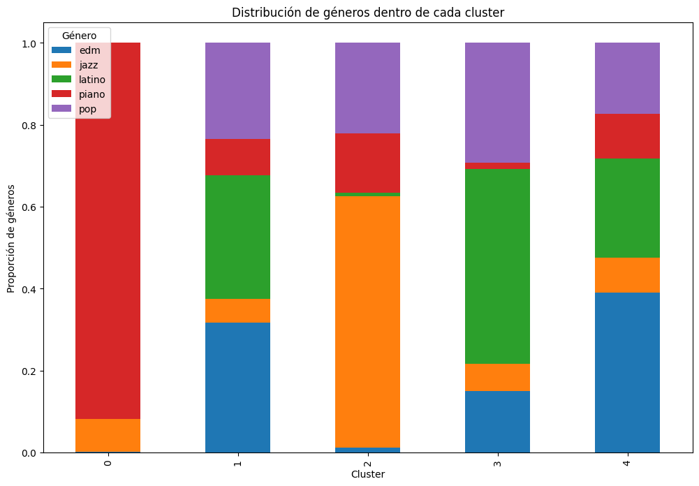

### DBSCAN
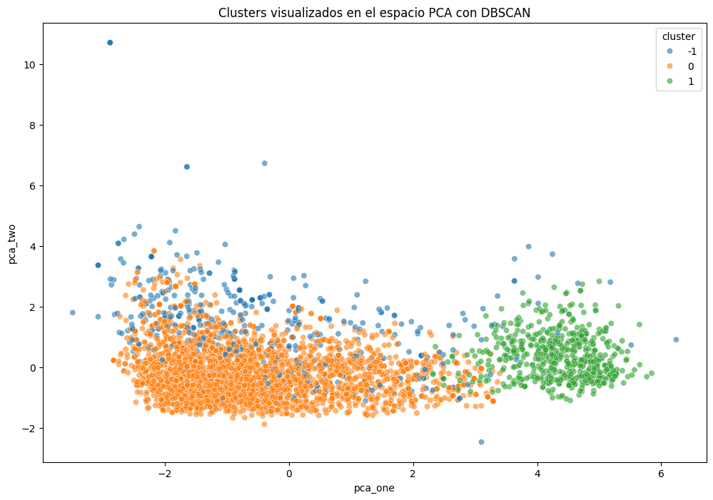
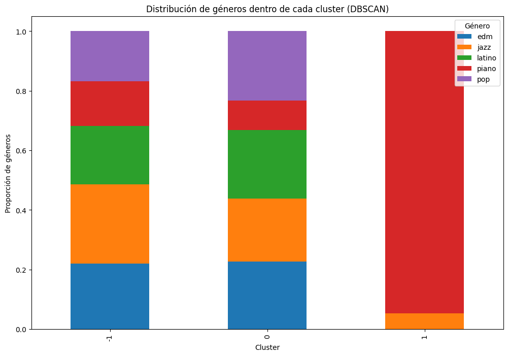

### Hierarchical Clustering
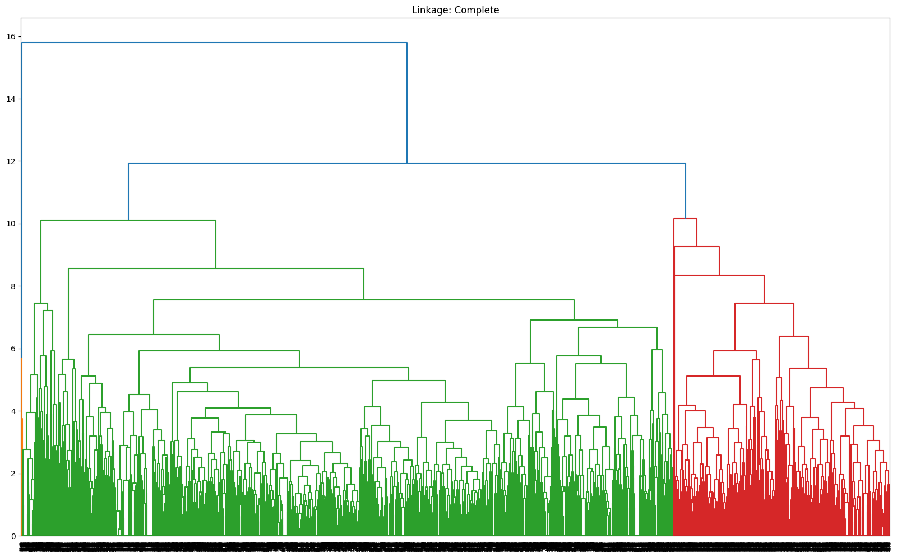
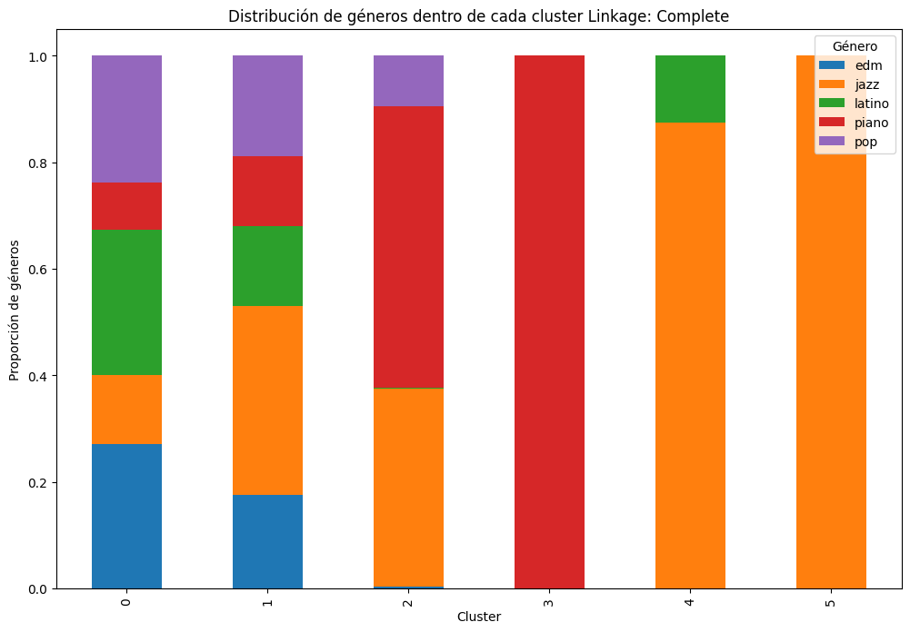

### Evaluación:
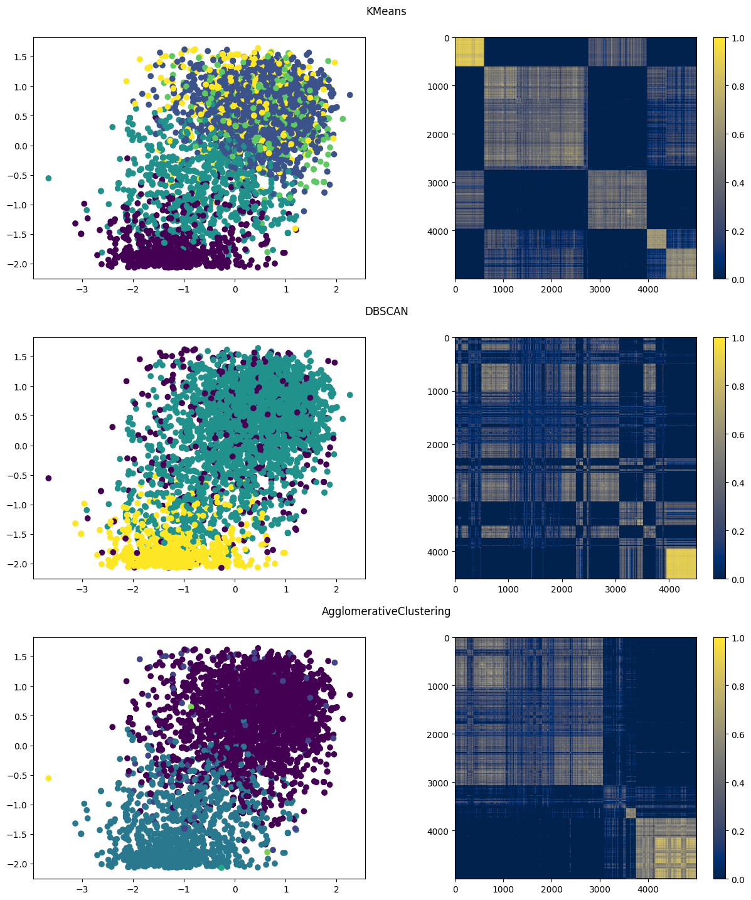

## (3) ¿Los géneros con más canciones explícitas comparten características entre ellos?

## Modelos 

### K-means

### DBSCAN
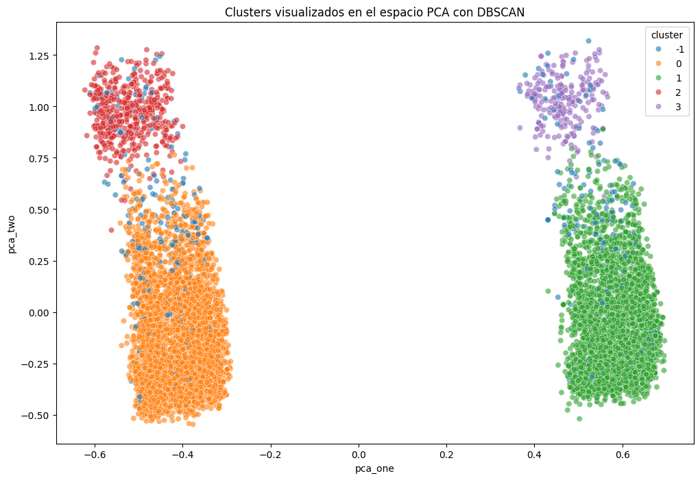

### Hierarchical Clustering

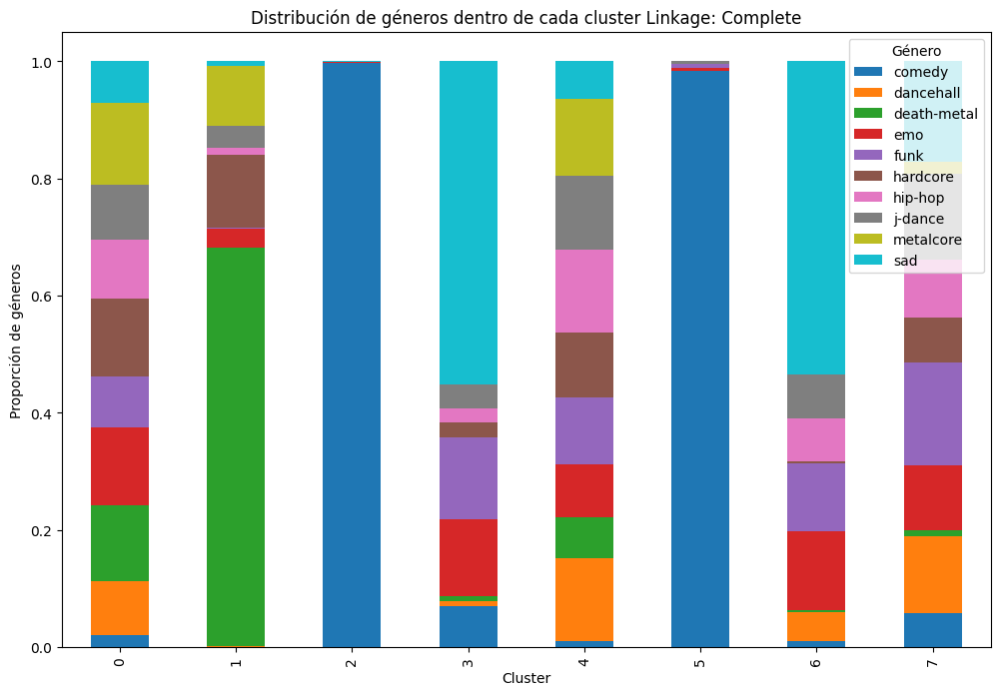

### Evaluación:
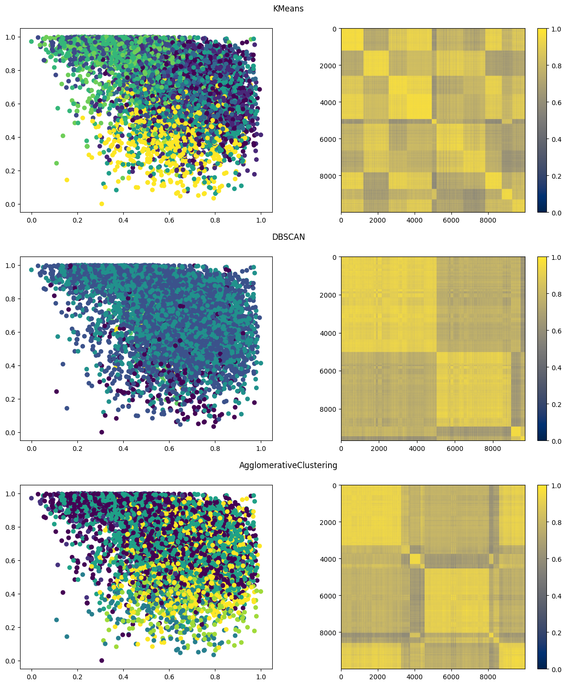

## Conclusión Hito 3:

>Volviendo a la pregunta de la metodología 2: ¿Existen géneros que, pese a ser distintos, sus canciones tienen atributos similares? ¿Y viceversa?
  
Como sabemos de antemano que trabajamos con 5 géneros, podemos darnos cuenta que aunque el coeficiente de silhouette para DBSCAN es alto, su matriz y grafico de clusters no se desempeña bien, esto ya que se basa unicamente en la densidad para formar el cluster, y aunque esto signifique una alta cohesión y distancia entre clusters, podemos ver que con k-means k=5 nuestro datos tienen una naturaleza dispersa.
  
Por otro lado, mediante el anáñisis de los patrones obtenido de los modelos, es posible responder la pregunta, en particular vemos que en todos los modelos, para los clusters asignados ocurre que hay canciones pertenecientes a distintos géneros. Es decir, géneros distintos comparten atributos musicales tal que los modelos los asignan en un mismo cluster al aprender estos patrones.
  
Por lo tanto, la respuesta es que si, existen géneros que pese a ser distintos comparten comparten atributos musicales. Además, veemos que canciones de un mismo género se encuentran asignadas en distintos clusters, por lo que también se responde que si a esta pregunta.

  
>Respecto a la pregunta de la metodología 3: ¿Los géneros con más canciones explícitas comparten características entre ellos?
  
Mediante el análisis de los clusters obtenidos, se puede responder que si, que aquellos géneros con más canciones explícitas comparten características entre sí. En particular se puede ver que el género comedy suele ser la única excepción a esta regla, pues el resto de géneros se encuentran combinados entre los clusters, indicando una similitud de sus atributos musicales.
  
En cuanto al desempeño de los modelos, nuevamente vemos que DBSCAN es aquel que tiene la mejor métrica de silhouette pero que al mismo tiempo falla nuevamente en distinguir claramente los clusters. Para k-means por otra parte vemos que al asignarle la cantidad de clusters es capaz de generar una mejor separación entre los clusters y aquellos que son más cercanos entre si. (Cercanos en atributos musicales, pero que pueden ser de géneros distintos)

## Trabajo a futuro:
>En base a lo trabajado durante cada pregunta, fue posible observar que el problema de predecir géneros en base a atributos musicales es complejo, y que los modelos empleados tuvieron que usar pocos géneros para tener un desempeño decente, por lo tanto, para mejorar este desempeño y también para extenderlo a una mayor cantidad de géneros es que se plantean las siguientes opciones:
  
(1) Implementación de Redes Neuronales: Esto permitirá construir un modelo con múltiples capas capaz de aprender mejor los atributos musicales, asimismo, será posible implementar los pesos y técnicas como backpropagation junto con dropout, las cuales permitirán no solo mejorar el modelo sino que extenderlo a más géneros.
  
(2) Implementación de Procesamiento de Lenguaje Natural: Como se vió en la pregunta 1, hay géneros que no tienen una característica que los distinga claramente del resto, como era el caso de "emo", por lo tanto el desempeño del modelo era poco eficiente al intentar clasificar canciones de dicho género. Una mejora a implementar es NLP, ya que con esto se podrá hacer uso de la letra de las canciones, lo que, en conjunto con técnicas como las capas de Atención, bidireccionalidad y word embeddings mejorarán el modelo y permitirán añadir la letra de la canción como una variable al momento de clasificar el género. Se hace mención específica a técnicas que implementan el contexto en el lenguaje pues esto permitirá clasificar una canción adecuadamente.